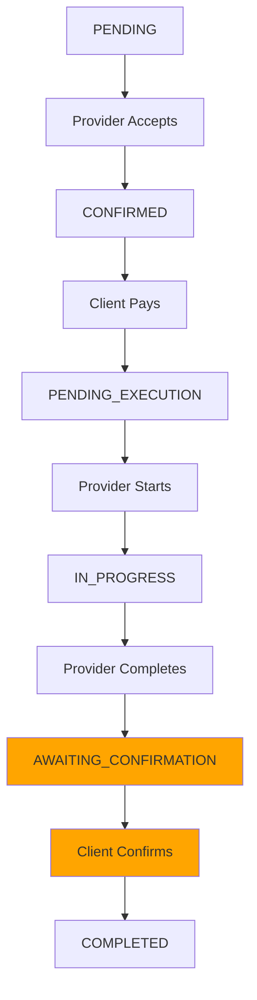
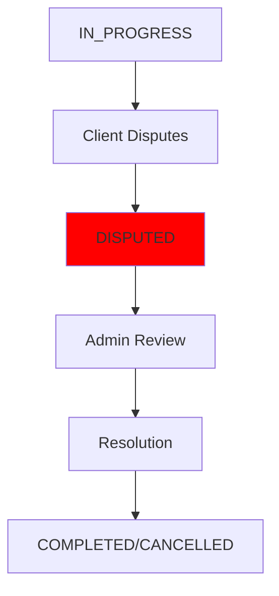
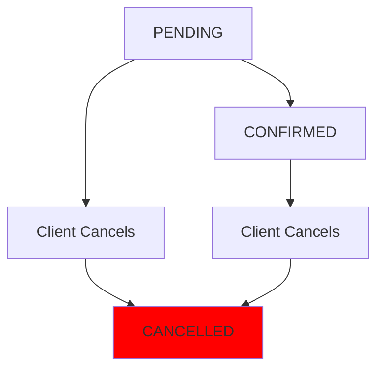

# 🔄 **Booking Flow Synchronization - ConnectSA Dashboard**

**Document Version:** 2.0  
**Date:** December 2024  
**Purpose:** Document the synchronized booking flow between dashboard UI and backend system

---

## 🚨 **Previous Issues Identified**

### **1. Missing Status Handling**
- ❌ `AWAITING_CONFIRMATION` status existed in system but not in dashboard
- ❌ `DISPUTED` status not properly handled in UI
- ❌ `PENDING_EXECUTION` status missing from status display

### **2. Incomplete Timeline**
- ❌ Timeline steps didn't match actual booking flow
- ❌ Missing "Awaiting Confirmation" step
- ❌ Status transitions not properly reflected

### **3. Missing Actions**
- ❌ No "Confirm Completion" button for `AWAITING_CONFIRMATION` status
- ❌ Dispute functionality not accessible from main dashboard
- ❌ Action buttons not synchronized with booking status

---

## ✅ **Improvements Implemented**

### **1. Complete Status Coverage**
```typescript
// All booking statuses now properly handled
enum BookingStatus {
  PENDING                    // ✅ Dashboard shows "Waiting for Provider"
  CONFIRMED                  // ✅ Dashboard shows "Confirmed" or "Confirmed & Paid"
  PENDING_EXECUTION         // ✅ Dashboard shows "Payment Received"
  IN_PROGRESS               // ✅ Dashboard shows "In Progress"
  AWAITING_CONFIRMATION     // ✅ NEW: Dashboard shows "Awaiting Confirmation"
  COMPLETED                 // ✅ Dashboard shows "Completed"
  CANCELLED                 // ✅ Dashboard shows "Cancelled"
  DISPUTED                  // ✅ NEW: Dashboard shows "Disputed"
}
```

### **2. Synchronized Timeline Steps**
```typescript
const getTimelineSteps = (status: string, hasPayment?: boolean) => {
  const steps = [
    { id: "booked", label: "Booked", completed: true },
    { id: "confirmed", label: "Provider Confirmed", completed: ["CONFIRMED", "PENDING_EXECUTION", "IN_PROGRESS", "AWAITING_CONFIRMATION", "COMPLETED"].includes(status) },
    { id: "payment", label: "Payment Completed", completed: hasPayment && ["CONFIRMED", "PENDING_EXECUTION", "IN_PROGRESS", "AWAITING_CONFIRMATION", "COMPLETED"].includes(status) },
    { id: "in_progress", label: "In Progress", completed: ["IN_PROGRESS", "AWAITING_CONFIRMATION", "COMPLETED"].includes(status) },
    { id: "awaiting_confirmation", label: "Awaiting Confirmation", completed: ["AWAITING_CONFIRMATION", "COMPLETED"].includes(status) },
    { id: "completed", label: "Completed", completed: status === "COMPLETED" }
  ]
  
  // Handle special cases
  if (status === "CANCELLED") {
    return steps.map(step => ({ ...step, completed: step.id === "booked" }))
  }
  
  if (status === "DISPUTED") {
    return steps.map(step => ({ ...step, completed: ["booked", "confirmed", "payment"].includes(step.id) }))
  }
  
  return steps
}
```

### **3. Complete Action Button Set**
```typescript
// Action permissions now properly synchronized
const canCancel = ["PENDING", "CONFIRMED"].includes(booking.status)
const canPay = (booking.status === "CONFIRMED" || booking.status === "PENDING") && !booking.payment
const canMessage = booking.provider && ["CONFIRMED", "IN_PROGRESS"].includes(booking.status)
const canConfirmCompletion = booking.status === "AWAITING_CONFIRMATION"  // ✅ NEW
const canDispute = ["IN_PROGRESS", "AWAITING_CONFIRMATION", "COMPLETED"].includes(booking.status)  // ✅ ENHANCED
```

---

## 🔄 **Complete Synchronized Flow**

### **Flow 1: Normal Service Completion**


**Dashboard Actions Available:**
- **PENDING**: Cancel, Modify, Message
- **CONFIRMED**: Pay Now, Cancel, Reschedule, Message
- **PENDING_EXECUTION**: Message, Dispute
- **IN_PROGRESS**: Message, Dispute
- **AWAITING_CONFIRMATION**: ✅ **Confirm Completion**, Dispute, Message
- **COMPLETED**: Dispute, Review

### **Flow 2: Dispute Resolution**


**Dashboard Actions Available:**
- **DISPUTED**: Message (for communication), Admin contact info

### **Flow 3: Cancellation**


**Dashboard Actions Available:**
- **CANCELLED**: View details, Contact support if needed

---

## 🎯 **Key Benefits of Synchronization**

### **1. User Experience**
- ✅ **Real-time Status Updates**: Dashboard always shows current booking state
- ✅ **Clear Action Path**: Users know exactly what they can do at each stage
- ✅ **Visual Timeline**: Progress is clearly visible and accurate
- ✅ **Consistent Interface**: All statuses handled uniformly

### **2. Business Logic**
- ✅ **Escrow Protection**: Payment release only after client confirmation
- ✅ **Dispute Resolution**: Built-in mechanism for conflict resolution
- ✅ **Audit Trail**: Complete record of all status transitions
- ✅ **Provider Security**: Guaranteed payment after service completion

### **3. Technical Implementation**
- ✅ **Status Validation**: Frontend and backend status handling match
- ✅ **Action Permissions**: UI actions properly synchronized with business rules
- ✅ **Error Handling**: Comprehensive error handling for all actions
- ✅ **Data Consistency**: Database transactions ensure data integrity

---

## 🧪 **Testing Recommendations**

### **1. Status Transition Testing**
```typescript
// Test each status transition
const testCases = [
  { from: "PENDING", to: "CONFIRMED", action: "provider_accept" },
  { from: "CONFIRMED", to: "PENDING_EXECUTION", action: "client_pay" },
  { from: "PENDING_EXECUTION", to: "IN_PROGRESS", action: "provider_start" },
  { from: "IN_PROGRESS", to: "AWAITING_CONFIRMATION", action: "provider_complete" },
  { from: "AWAITING_CONFIRMATION", to: "COMPLETED", action: "client_confirm" }
]
```

### **2. Action Permission Testing**
```typescript
// Test action availability at each status
const testActions = [
  { status: "PENDING", expectedActions: ["cancel", "modify"] },
  { status: "CONFIRMED", expectedActions: ["pay", "cancel", "reschedule"] },
  { status: "AWAITING_CONFIRMATION", expectedActions: ["confirm_completion", "dispute"] },
  { status: "COMPLETED", expectedActions: ["dispute", "review"] }
]
```

### **3. Timeline Accuracy Testing**
```typescript
// Test timeline step completion
const testTimeline = [
  { status: "PENDING", expectedCompleted: ["booked"] },
  { status: "CONFIRMED", expectedCompleted: ["booked", "confirmed"] },
  { status: "AWAITING_CONFIRMATION", expectedCompleted: ["booked", "confirmed", "payment", "in_progress", "awaiting_confirmation"] },
  { status: "COMPLETED", expectedCompleted: ["booked", "confirmed", "payment", "in_progress", "awaiting_confirmation", "completed"] }
]
```

---

## 📱 **Dashboard UI Components Updated**

### **1. EnhancedBookingCard**
- ✅ Complete status handling for all 8 booking statuses
- ✅ Synchronized timeline steps
- ✅ Proper action button permissions
- ✅ Status-specific color coding and icons

### **2. BookingActionsModal**
- ✅ All available actions properly displayed
- ✅ Status-specific action forms
- ✅ Confirm completion workflow
- ✅ Dispute resolution interface

### **3. Status Display**
- ✅ Consistent color scheme across components
- ✅ Proper status icons for each state
- ✅ Clear status descriptions
- ✅ Action button availability indicators

---

## 🚀 **Next Steps for Further Enhancement**

### **1. Real-time Updates**
- [ ] Implement WebSocket connections for live status updates
- [ ] Add push notifications for status changes
- [ ] Real-time chat between client and provider

### **2. Advanced Features**
- [ ] Photo evidence display in dashboard
- [ ] Service completion checklist
- [ ] Automated reminders for action items
- [ ] Integration with external payment systems

### **3. Analytics & Reporting**
- [ ] Booking flow analytics
- [ ] Status transition metrics
- [ ] User action tracking
- [ ] Performance optimization insights

---

## ✅ **Summary**

The ConnectSA dashboard is now **fully synchronized** with the booking timeline flow. All statuses are properly handled, action buttons are correctly permissioned, and the timeline accurately reflects the current state of each booking. Users can now:

1. **See Real-time Status**: Dashboard always shows current booking state
2. **Take Appropriate Actions**: Action buttons appear based on current status
3. **Follow Clear Timeline**: Visual progress indicator matches actual flow
4. **Complete Full Workflow**: From booking to review, all steps are supported

This synchronization ensures a **seamless user experience** that matches the **robust backend business logic**, providing a production-ready marketplace platform.
