# 🔄 ConnectSA User Flows Overview

**Document Version:** 1.0  
**Date:** December 2024  
**Purpose:** User journey documentation for stakeholders and new team members  

---

## 📋 Table of Contents

1. [User Types & Roles](#user-types--roles)
2. [Client User Flows](#client-user-flows)
3. [Provider User Flows](#provider-user-flows)
4. [Admin User Flows](#admin-user-flows)
5. [System Flows](#system-flows)
6. [Error Handling & Edge Cases](#error-handling--edge-cases)
7. [Success Metrics](#success-metrics)

---

## 👥 User Types & Roles

### **1. Client (Service Requester)**
- **Primary Goal**: Find and book services from providers
- **Key Activities**: Browse services, make bookings, pay for services, leave reviews
- **Access Level**: Client dashboard, booking management, payment processing

### **2. Provider (Service Provider)**
- **Primary Goal**: Offer services, manage bookings, earn income
- **Key Activities**: Complete onboarding, manage availability, accept bookings, provide services
- **Access Level**: Provider dashboard, booking management, earnings tracking

### **3. Admin (Platform Administrator)**
- **Primary Goal**: Manage platform operations, ensure quality, resolve disputes
- **Key Activities**: Approve providers, monitor transactions, resolve disputes, manage services
- **Access Level**: Admin dashboard, full system access, analytics

---

## 🏠 Client User Flows

### **Flow 1: Client Registration & Onboarding**

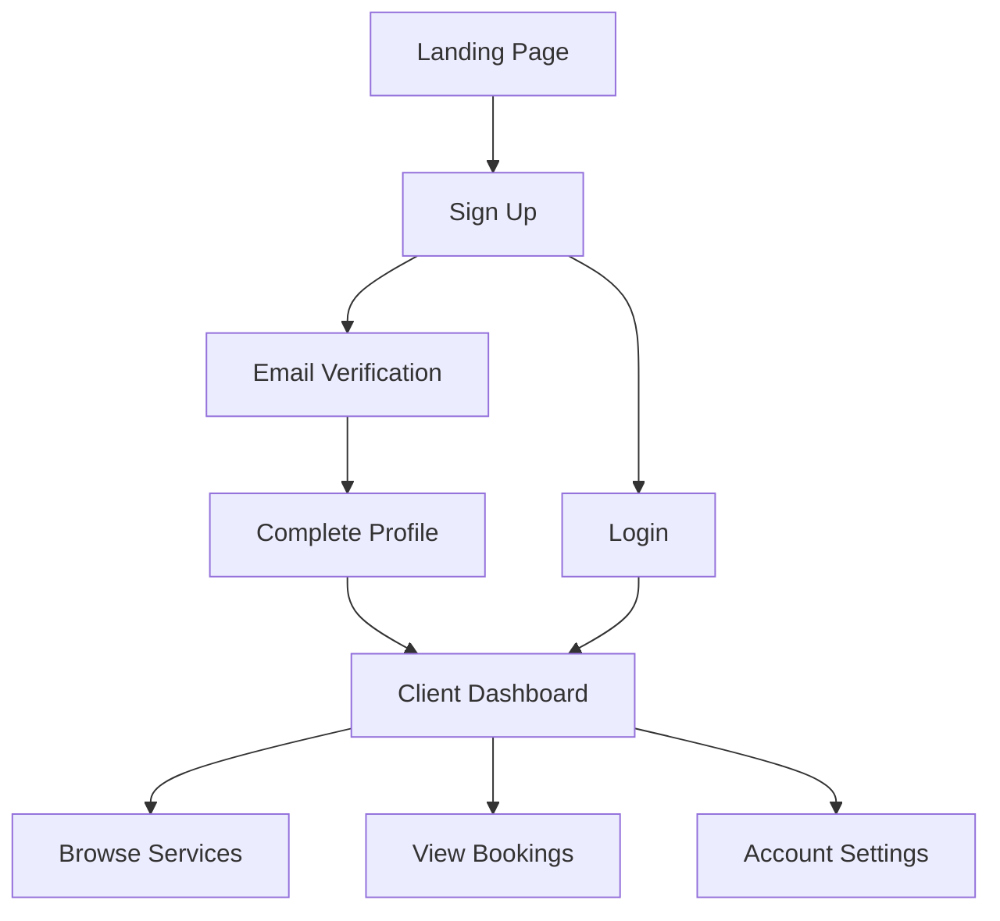

#### **Step-by-Step Process:**

1. **Landing Page Access**
   - User visits ConnectSA homepage
   - Views service categories and featured providers
   - Clicks "Get Started" or "Sign Up"

2. **Registration Process**
   - **Form Fields**: Name, email, password, phone number
   - **Validation**: Email format, password strength, phone validation
   - **Terms & Conditions**: Must accept platform terms
   - **Privacy Policy**: Must accept privacy policy

3. **Email Verification**
   - Verification email sent automatically
   - 24-hour expiration for verification link
   - Resend verification option available
   - Cannot proceed without verification

4. **Profile Completion**
   - **Required**: Profile picture, address, preferences
   - **Optional**: Additional contact methods, service preferences
   - **Security**: Two-factor authentication setup (optional)

5. **Dashboard Access**
   - Welcome tour for new users
   - Quick start guide
   - Service recommendations based on location

#### **Best Practices:**
- ✅ Progressive disclosure (show only necessary fields initially)
- ✅ Clear validation messages
- ✅ Mobile-responsive design
- ✅ Social login options (Google, Apple)
- ✅ Password strength indicator

---

### **Flow 2: Service Booking Process**

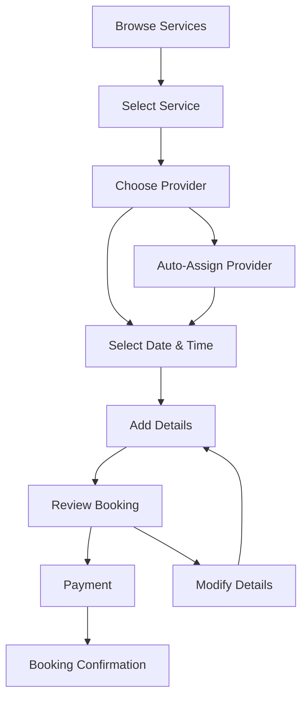

#### **Step-by-Step Process:**

1. **Service Discovery**
   - **Browse Categories**: Cleaning, Plumbing, Electrical, etc.
   - **Search Function**: Location-based, service type, price range
   - **Filter Options**: Rating, availability, price, distance
   - **Provider Profiles**: View ratings, reviews, experience

2. **Service Selection**
   - **Service Details**: Description, pricing, duration
   - **Provider Information**: Bio, certifications, experience
   - **Reviews & Ratings**: Previous client feedback
   - **Availability Calendar**: Real-time availability check

3. **Provider Assignment**
   - **Manual Selection**: Choose specific provider
   - **Auto-Assignment**: System matches best available provider
   - **Provider Preferences**: Based on rating, distance, availability
   - **Fallback Options**: Alternative providers if preferred unavailable

4. **Scheduling**
   - **Date Selection**: Calendar interface with availability
   - **Time Slots**: Available time windows
   - **Duration**: Service duration estimation
   - **Urgency Options**: Same-day, next-day, scheduled

5. **Booking Details**
   - **Service Description**: Detailed requirements
   - **Location**: Service address with map integration
   - **Special Instructions**: Any specific requirements
   - **Contact Information**: How to reach client

6. **Review & Payment**
   - **Booking Summary**: Service, provider, date, price
   - **Terms & Conditions**: Service agreement
   - **Payment Method**: Credit card, bank transfer, mobile money
   - **Escrow Protection**: Funds held until service completion

7. **Confirmation**
   - **Booking Confirmation**: Email and SMS notification
   - **Provider Contact**: Direct communication channel
   - **Service Reminders**: 24h and 1h before service
   - **Tracking**: Real-time service status updates

#### **Best Practices:**
- ✅ Clear pricing breakdown
- ✅ Real-time availability checking
- ✅ Multiple payment options
- ✅ Booking modification options
- ✅ Service guarantee and insurance

---

### **Flow 3: Service Execution & Completion**

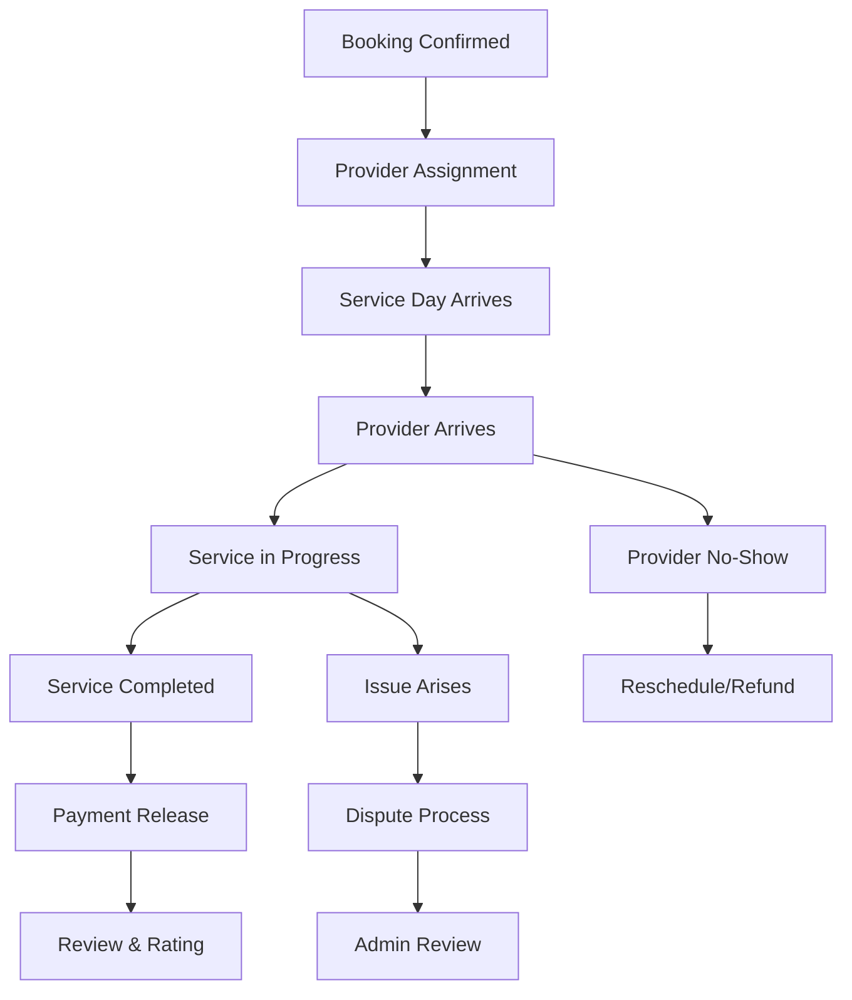

#### **Step-by-Step Process:**

1. **Pre-Service Communication**
   - **Provider Contact**: Direct messaging with provider
   - **Service Confirmation**: Provider confirms availability
   - **Location Sharing**: Real-time location tracking
   - **Service Reminders**: Automated notifications

2. **Service Day**
   - **Provider Arrival**: Real-time arrival notification
   - **Service Start**: Provider marks service as started
   - **Progress Updates**: Regular status updates
   - **Issue Reporting**: Immediate problem reporting

3. **Service Completion**
   - **Completion Confirmation**: Provider marks service complete
   - **Photo Evidence**: Before/after photos (optional)
   - **Client Verification**: Client confirms completion
   - **Payment Release**: Escrow funds released to provider

4. **Post-Service**
   - **Review System**: Rate provider and service quality
   - **Feedback**: Detailed review and comments
   - **Follow-up**: Additional services or recommendations
   - **Dispute Resolution**: Issue reporting if needed

#### **Best Practices:**
- ✅ Real-time status updates
- ✅ Photo evidence for verification
- ✅ Clear communication channels
- ✅ Dispute resolution process
- ✅ Service guarantee protection

---

## 🛠️ Provider User Flows

### **Flow 1: Provider Registration & Onboarding**

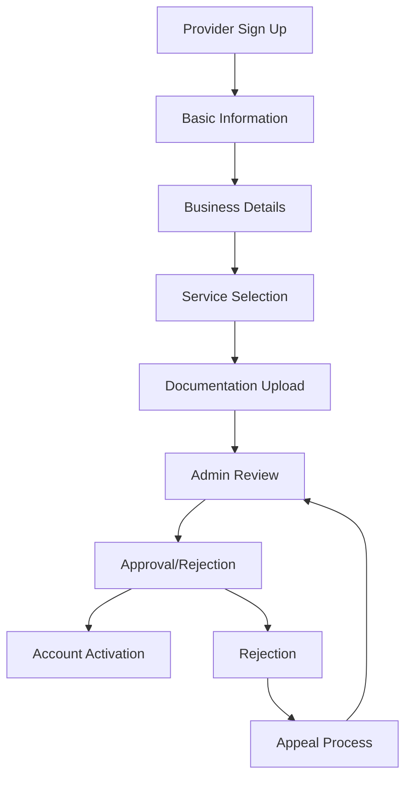

#### **Step-by-Step Process:**

1. **Initial Registration**
   - **Basic Information**: Name, email, phone, password
   - **Business Type**: Individual, company, partnership
   - **Service Categories**: Primary and secondary services
   - **Experience Level**: Years of experience, certifications

2. **Business Profile**
   - **Business Name**: Official business name
   - **Description**: Service description and specialties
   - **Location**: Service areas and coverage
   - **Operating Hours**: Availability schedule

3. **Service Configuration**
   - **Service Types**: Select offered services
   - **Pricing Structure**: Hourly rates, fixed prices
   - **Service Areas**: Geographic coverage
   - **Availability**: Working hours and days

4. **Documentation**
   - **Identity Verification**: Government ID upload
   - **Business Registration**: Business license/certificate
   - **Insurance**: Liability insurance certificate
   - **References**: Professional references

5. **Admin Review**
   - **Document Verification**: Admin reviews uploaded documents
   - **Background Check**: Basic background verification
   - **Interview**: Optional phone/video interview
   - **Decision**: Approval or rejection with feedback

6. **Account Activation**
   - **Welcome Kit**: Platform guidelines and best practices
   - **Training**: Platform usage training
   - **Profile Setup**: Complete profile optimization
   - **First Booking**: Receive first booking opportunity

#### **Best Practices:**
- ✅ Clear documentation requirements
- ✅ Transparent review process
- ✅ Support during onboarding
- ✅ Training and resources
- ✅ Feedback for rejected applications

---

### **Flow 2: Provider Booking Management**

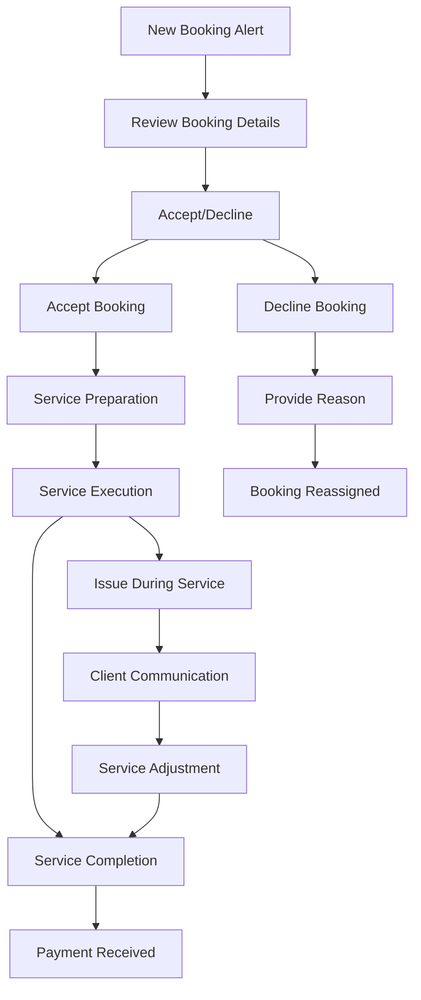

#### **Step-by-Step Process:**

1. **Booking Notification**
   - **Real-time Alerts**: Instant notification of new bookings
   - **Booking Details**: Service type, location, date, client info
   - **Response Time**: 2-hour response window
   - **Auto-Decline**: Automatic decline if no response

2. **Booking Review**
   - **Service Requirements**: Detailed service description
   - **Client Information**: Contact details and preferences
   - **Location Details**: Service address and access instructions
   - **Pricing**: Agreed service price and platform fees

3. **Booking Response**
   - **Accept**: Confirm availability and acceptance
   - **Decline**: Provide reason for decline
   - **Modify**: Request changes to booking details
   - **Questions**: Ask for additional information

4. **Service Preparation**
   - **Schedule Management**: Add to calendar and set reminders
   - **Route Planning**: Optimize travel route
   - **Equipment Check**: Ensure all necessary tools
   - **Client Communication**: Confirm appointment details

5. **Service Execution**
   - **Arrival Notification**: Mark arrival at service location
   - **Service Start**: Begin service and update status
   - **Progress Updates**: Regular status updates
   - **Issue Handling**: Report any problems immediately

6. **Service Completion**
   - **Completion Confirmation**: Mark service as complete
   - **Photo Documentation**: Upload before/after photos
   - **Client Handover**: Brief client on work completed
   - **Payment Processing**: Automatic payment release

#### **Best Practices:**
- ✅ Quick response times
- ✅ Clear communication
- ✅ Professional service delivery
- ✅ Proper documentation
- ✅ Follow-up support

---

### **Flow 3: Provider Earnings & Analytics**

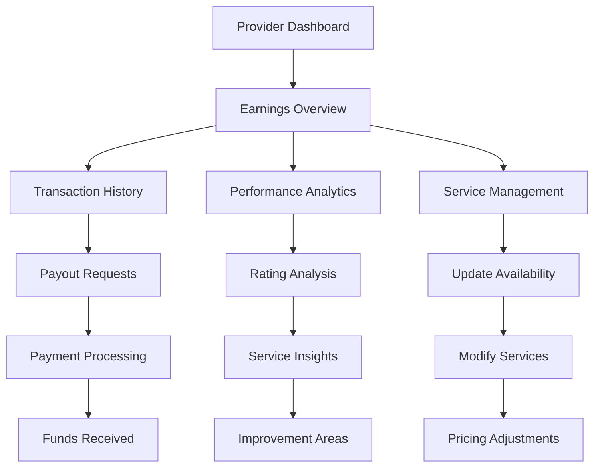

#### **Step-by-Step Process:**

1. **Earnings Dashboard**
   - **Total Earnings**: Lifetime and period earnings
   - **Pending Payments**: Funds awaiting release
   - **Completed Services**: Number of successful services
   - **Average Rating**: Overall client satisfaction

2. **Transaction Management**
   - **Payment History**: Detailed transaction records
   - **Service Breakdown**: Earnings by service type
   - **Platform Fees**: Transparent fee structure
   - **Tax Information**: Tax reporting assistance

3. **Payout Process**
   - **Payout Schedule**: Weekly or monthly payouts
   - **Minimum Threshold**: Minimum payout amount
   - **Payment Methods**: Bank transfer, mobile money
   - **Processing Time**: 2-5 business days

4. **Performance Analytics**
   - **Service Metrics**: Completion rate, response time
   - **Client Feedback**: Rating trends and comments
   - **Revenue Analysis**: Earnings patterns and growth
   - **Market Insights**: Service demand and pricing

5. **Service Optimization**
   - **Availability Management**: Update working hours
   - **Service Expansion**: Add new service types
   - **Pricing Strategy**: Adjust rates based on demand
   - **Quality Improvement**: Address feedback and ratings

#### **Best Practices:**
- ✅ Transparent fee structure
- ✅ Regular payout schedules
- ✅ Detailed analytics
- ✅ Performance insights
- ✅ Growth opportunities

---

## 👨‍💼 Admin User Flows

### **Flow 1: Provider Management**

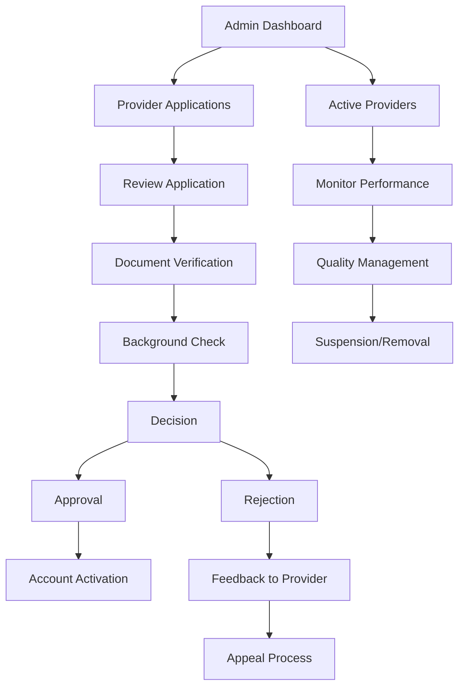

#### **Step-by-Step Process:**

1. **Application Review**
   - **Application Queue**: New provider applications
   - **Document Review**: Verify uploaded documents
   - **Background Check**: Basic verification process
   - **Interview**: Optional provider interview

2. **Approval Process**
   - **Decision Criteria**: Experience, documentation, references
   - **Approval Workflow**: Multi-step approval process
   - **Account Setup**: Create provider account
   - **Welcome Process**: Onboarding and training

3. **Ongoing Management**
   - **Performance Monitoring**: Track provider metrics
   - **Quality Assurance**: Monitor service quality
   - **Complaint Handling**: Address client complaints
   - **Policy Enforcement**: Ensure compliance

4. **Disciplinary Actions**
   - **Warning System**: Progressive discipline approach
   - **Suspension**: Temporary account suspension
   - **Termination**: Permanent account removal
   - **Appeal Process**: Provider appeal rights

#### **Best Practices:**
- ✅ Fair and consistent review process
- ✅ Clear approval criteria
- ✅ Ongoing quality monitoring
- ✅ Transparent disciplinary process
- ✅ Appeal and review mechanisms

---

### **Flow 2: Dispute Resolution**

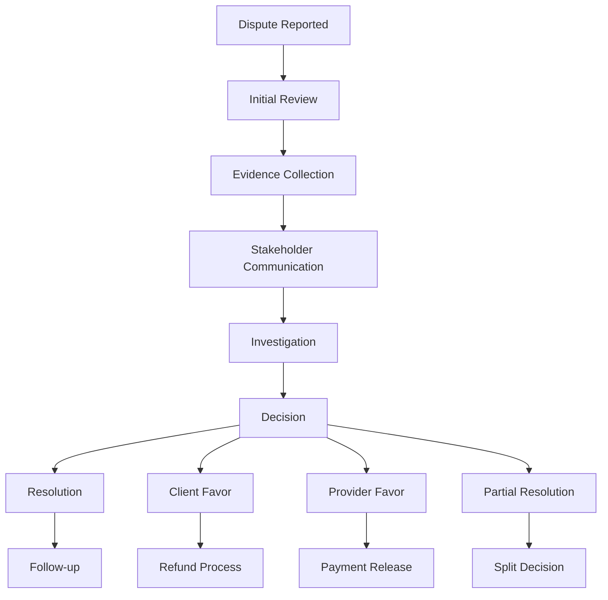

#### **Step-by-Step Process:**

1. **Dispute Intake**
   - **Report Submission**: Client or provider reports issue
   - **Initial Assessment**: Determine dispute type and severity
   - **Evidence Request**: Request relevant documentation
   - **Communication Setup**: Establish communication channels

2. **Investigation Process**
   - **Evidence Review**: Examine all submitted evidence
   - **Stakeholder Interviews**: Speak with all parties involved
   - **Service History**: Review provider's service history
   - **Platform Data**: Analyze booking and payment data

3. **Decision Making**
   - **Policy Application**: Apply platform policies and terms
   - **Fairness Assessment**: Ensure fair treatment of all parties
   - **Resolution Options**: Determine appropriate resolution
   - **Documentation**: Document decision and reasoning

4. **Resolution Implementation**
   - **Payment Adjustments**: Process refunds or payments
   - **Account Actions**: Apply any account restrictions
   - **Communication**: Notify all parties of decision
   - **Follow-up**: Ensure resolution is implemented

#### **Best Practices:**
- ✅ Impartial investigation process
- ✅ Clear communication with all parties
- ✅ Fair and consistent decision making
- ✅ Proper documentation
- ✅ Follow-up and monitoring

---

### **Flow 3: Platform Analytics & Management**

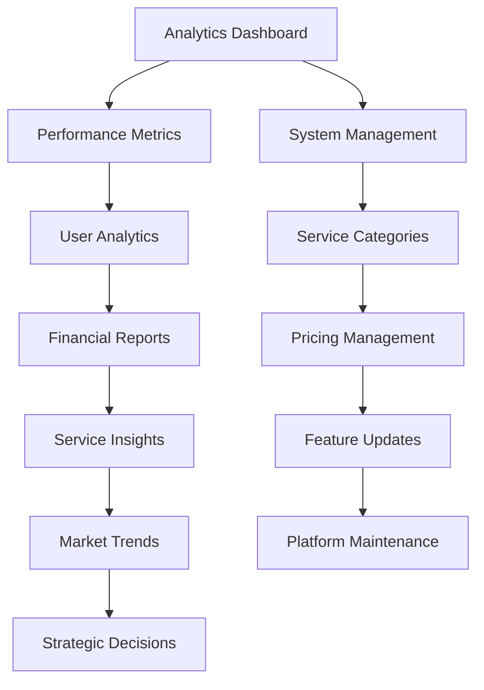

#### **Step-by-Step Process:**

1. **Performance Monitoring**
   - **User Metrics**: Registration, retention, engagement
   - **Service Metrics**: Booking volume, completion rates
   - **Financial Metrics**: Revenue, fees, payment processing
   - **Quality Metrics**: Ratings, complaints, disputes

2. **Market Analysis**
   - **Service Demand**: Popular services and trends
   - **Geographic Analysis**: Service demand by location
   - **Pricing Analysis**: Market rates and competitiveness
   - **Competitor Analysis**: Market position and opportunities

3. **Strategic Planning**
   - **Feature Development**: New features and improvements
   - **Market Expansion**: New service categories or locations
   - **Partnership Development**: Strategic partnerships
   - **Policy Updates**: Platform policies and procedures

4. **System Management**
   - **Service Categories**: Add or modify service types
   - **Pricing Structure**: Adjust platform fees and policies
   - **Feature Rollout**: Deploy new features and updates
   - **Maintenance**: System updates and optimization

#### **Best Practices:**
- ✅ Data-driven decision making
- ✅ Regular performance reviews
- ✅ Strategic planning and execution
- ✅ Continuous improvement
- ✅ Stakeholder communication

---

## ⚙️ System Flows

### **Flow 1: Payment Processing & Escrow**

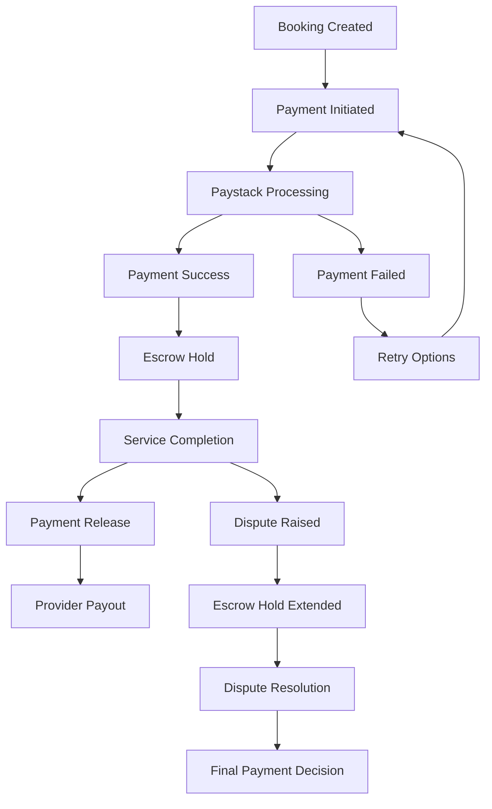

### **Flow 2: Provider Matching Algorithm**

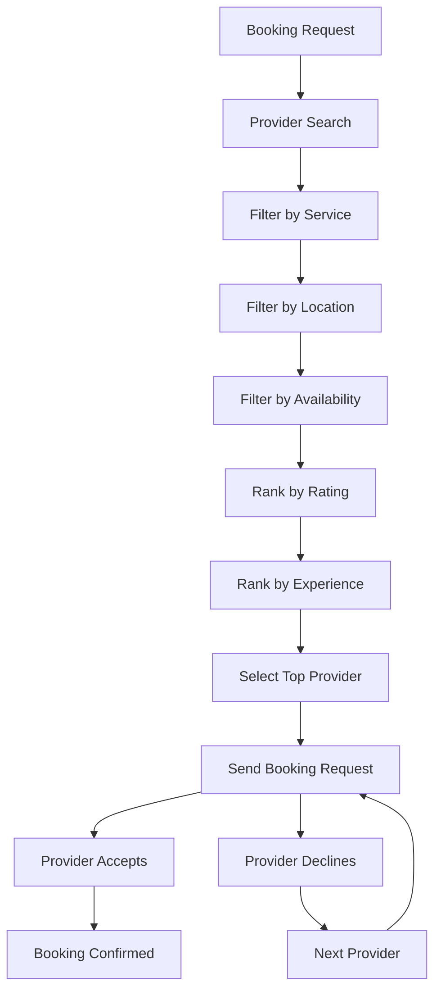

### **Flow 3: Notification System**

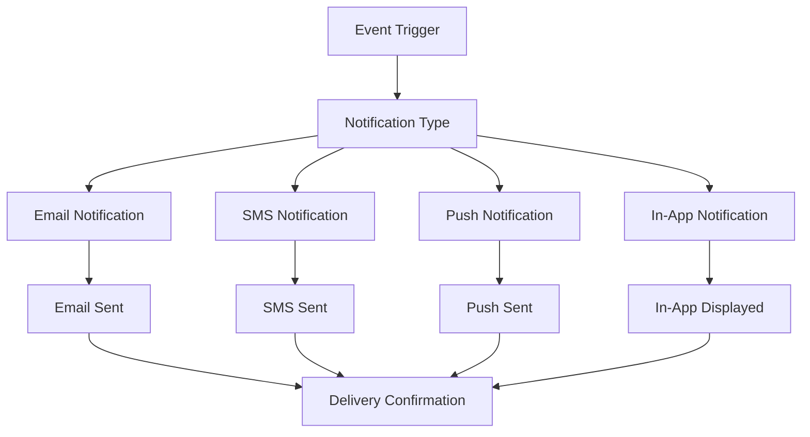

---

## ⚠️ Error Handling & Edge Cases

### **Common Error Scenarios**

1. **Payment Failures**
   - **Scenario**: Payment processing fails
   - **Handling**: Retry mechanism, alternative payment methods
   - **User Communication**: Clear error messages and next steps

2. **Provider No-Show**
   - **Scenario**: Provider doesn't arrive for service
   - **Handling**: Automatic refund, provider penalty, reassignment
   - **User Communication**: Immediate notification and resolution

3. **Service Quality Issues**
   - **Scenario**: Client dissatisfied with service quality
   - **Handling**: Dispute process, partial refund, service redo
   - **User Communication**: Support team intervention

4. **Technical Issues**
   - **Scenario**: Platform downtime or technical problems
   - **Handling**: Service status page, alternative contact methods
   - **User Communication**: Proactive notifications and updates

### **Edge Case Management**

1. **Emergency Situations**
   - **Medical Emergencies**: Immediate service cancellation
   - **Safety Issues**: Emergency contact procedures
   - **Natural Disasters**: Service postponement policies

2. **Legal Issues**
   - **Contract Disputes**: Legal team involvement
   - **Regulatory Changes**: Policy updates and compliance
   - **Insurance Claims**: Claims processing and support

3. **Data Privacy**
   - **Data Breaches**: Incident response procedures
   - **Privacy Complaints**: Privacy officer review
   - **Regulatory Requests**: Legal compliance handling

---

## 📊 Success Metrics

### **User Experience Metrics**

1. **Client Satisfaction**
   - **Net Promoter Score (NPS)**: Target > 50
   - **Service Completion Rate**: Target > 95%
   - **Repeat Booking Rate**: Target > 60%
   - **Average Rating**: Target > 4.5/5

2. **Provider Satisfaction**
   - **Provider Retention Rate**: Target > 80%
   - **Average Provider Rating**: Target > 4.5/5
   - **Provider Earnings Growth**: Target > 20% monthly
   - **Provider Response Time**: Target < 2 hours

3. **Platform Performance**
   - **System Uptime**: Target > 99.9%
   - **Page Load Time**: Target < 2 seconds
   - **API Response Time**: Target < 200ms
   - **Error Rate**: Target < 1%

### **Business Metrics**

1. **Growth Metrics**
   - **User Registration**: Monthly growth rate
   - **Booking Volume**: Transaction growth
   - **Revenue Growth**: Platform fee revenue
   - **Market Penetration**: Geographic expansion

2. **Operational Metrics**
   - **Dispute Resolution Time**: Average resolution time
   - **Customer Support Response**: Response time and satisfaction
   - **Platform Efficiency**: Automation and optimization
   - **Cost Management**: Operational cost optimization

---

## 📝 Conclusion

This user flows overview provides a comprehensive understanding of how different users interact with the ConnectSA platform. The flows are designed with best practices in mind, ensuring:

- **User-Centric Design**: All flows prioritize user experience and satisfaction
- **Clear Communication**: Transparent processes and expectations
- **Efficient Operations**: Streamlined workflows and automation
- **Quality Assurance**: Built-in quality checks and monitoring
- **Scalability**: Flows designed to handle growth and expansion

The platform's success depends on the seamless execution of these user flows, supported by robust technology, clear policies, and excellent customer service.

---

**Document Prepared By:** Development Team  
**Review Date:** December 2024  
**Next Review:** January 2025  
**Version:** 1.0 